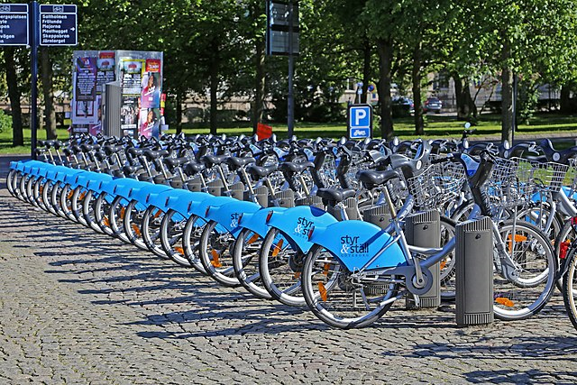

# Bike‑Sharing‑Daily

A data science / machine learning project analyzing daily bike‑sharing demand and deploying a dashboard via Streamlit.




## Project Overview

This project explores and models the daily demand for a bike sharing system. The tasks include:

- Data exploration & visualization  
- Feature engineering  
- Predictive modeling (regression)  
- Deployment of a dashboard to allow interactive exploration and demand prediction  

You can see a live version of the dashboard here:  
[Streamlit App](https://bike-sharing-daily-a6spk8guztgfrarhfedxny.streamlit.app/)  

## Features

- Exploratory Data Analysis (EDA) on bike sharing usage  
- Correlation analysis among features  
- Training of regression models to predict daily rentals  
- Saving and loading of trained model (`.p` pickle file)  
- Interactive dashboard for users to input weather/parameters and get predicted count  

## Dataset

The dataset `bike_sharing_daily.csv` (included in the repo) contains daily counts of total rental bikes along with relevant features (weather, seasonal, holiday, etc.).  
You will find feature descriptions in the notebook and comments.

## Repository Structure

```
Bike‑Sharing‑Daily/
├── Bicycle-sharing_systems.png  
├── bike_sharing_daily.csv  
├── bike_sharing_daily.ipynb  
├── bike_sharing_daily_dashboard.py  
├── bike_sharing_daily_model.p  
├── requirements.txt  
└── README.md  
```

- **Bicycle-sharing_systems.png** — an illustrative image  
- **bike_sharing_daily.csv** — the dataset  
- **bike_sharing_daily.ipynb** — exploration, modeling, analysis  
- **bike_sharing_daily_dashboard.py** — code for Streamlit app  
- **bike_sharing_daily_model.p** — serialized model object  
- **requirements.txt** — Python package dependencies  

## Installation & Setup

1. Clone the repository:

    ```bash
    git clone https://github.com/Omayma-ali/Bike-Sharing-Daily.git
    cd Bike-Sharing-Daily
    ```

2. (Optional) Create a virtual environment:

    ```bash
    python3 -m venv venv
    source venv/bin/activate   # On Windows: venv\Scripts\activate
    ```

3. Install dependencies:

    ```bash
    pip install -r requirements.txt
    ```

## Usage

### Running locally

To run the Streamlit dashboard locally:

```bash
streamlit run bike_sharing_daily_dashboard.py
```

Then open the provided local URL (e.g. `localhost:8501`) in your browser.

### Predicting manually

You can also load the trained model in a Python script or notebook:

```python
import pickle
model = pickle.load(open("bike_sharing_daily_model.p", "rb"))

# example: predict using a feature vector (weather, season, etc.)
X_new = [[...]]  # shape matching what the model expects
y_pred = model.predict(X_new)
print("Predicted bike count:", y_pred)
```

## Modeling & Results

Inside `bike_sharing_daily.ipynb`, you’ll find:

- Exploratory data analysis (distributions, correlations)  
- Feature engineering (dummy variables, scaling, etc.)  
- Model training and evaluation (e.g. RMSE, MAE)  
- Interpretation of feature importances  

The final model is serialized as `bike_sharing_daily_model.p`.

## Dashboard / Web App

The `bike_sharing_daily_dashboard.py` file defines a Streamlit app. It allows:

- Input of weather, seasonal, and other feature values  
- Display of predicted daily bike usage  
- Visualizations (if included) of trends or feature distributions  

You can deploy this Streamlit app (e.g. on Streamlit Cloud, Heroku, or another hosting service).

## Dependencies

Dependencies are listed in `requirements.txt`. Some likely packages include:

- pandas  
- numpy  
- scikit-learn  
- streamlit  
- matplotlib / seaborn  

You can install them with:

```bash
pip install -r requirements.txt
```

## Contributing

Contributions are welcome! To contribute:

1. Fork the repository  
2. Create a feature branch (`git checkout -b feature/YourFeature`)  
3. Make your changes & commit  
4. Push to your fork (`git push origin feature/YourFeature`)  
5. Create a Pull Request  

Be sure to update documentation and tests as needed.

## License

Specify your project license here (e.g. MIT, Apache 2.0).

## Author

**Omayma Ali** — Data Analyst / Data Scientist  
- [GitHub](https://github.com/Omayma-ali)
- [LinkedIn](www.linkedin.com/in/omayma-ali)  
- [Fiverr](https://www.fiverr.com/users/omaymaaa)
- [Khamsat](https://khamsat.com/user/omayma_ali) 

---

